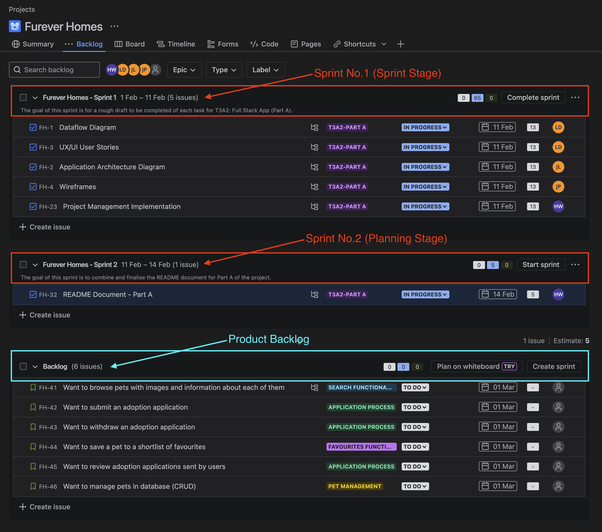

# Furever Homes 🏡🐶

A Pet Adoption & Shelter Management Application

## GitHub Repository Links

| Repository | Link |
|------------|------|
| Furever Homes - Organisation Page | [https://github.com/Furever-Homes](https://github.com/Furever-Homes) |
| Furever Homes - Full Stack Application | [https://github.com/Furever-Homes/T3A2-Part-B](https://github.com/Furever-Homes/T3A2-Part-B) |
| Furever Homes - Deployed Website | TBC |

## Contents

1) [What is "Furever Homes"?](#what-is-furever-homes)
2) [Tech Stack](#tech-stack)
3) [Dependencies](#dependencies)
4) [Dataflow Diagram](#dataflow-diagram)
5) [Application Architecture Diagram](#application-architecture-diagram)
6) [User Stories](#user-stories)
7) [Wireframes](#wireframes)
8) [Project Management: Jira](#project-management-jira)

## What is "Furever Homes"?

Furever homes is a platform which is designed to provide a simple and easy pet adoption experience, while also delivering a way for animal shelters to manage their operations efficiently.

The application includes features such as:

- Pet search functionality with filtering options
- Ability for adopters to shortlist pets into a 'favourites' section
- Application processes (Submit, Approve, Reject)
- Pet Data Management (CRUD)
- Secure user registration & login using JWT Authentication

## Tech Stack

    
    
    
    
    
    

  

 

**CSS**: Provides styling and accomodates for a responsive web application / user interace.  
**JavaScript**: A flexible programming language which is utilised for both the frontend and backend logic of the application.  
**React**: A JavaScript library which allows developers to create dynamic web applications by utilising a component-based architecture.  
**Node.js**: A JavaScript runtime environment which allows JavaScript to run on the server.  
**Express**: A backend framework for Node.js which manages API requests, middleware & route handling.  
**MongoDB**: A NoSQL database solution that stores data in a JSON-like format.

## Dependencies

### Frontend Dependencies

- axios: Used to make HTTP requests from the frontend to fetch the pet data, submit applications and manage authentication.
- jwt-decode: To decode JSON Web Tokens (JWT) to extract user information (e.g., checking if a user is an admin)
- react: The main library for building the UI components in a in re way
- react-dom: Provided the DOM-specific methods that were used to render React components in the browser
- react-router-dom: Enabled us to utilise navigation between different pages using routes (e.g., /explore, /profile, /admin).

### Backend Dependencies

- bcrypt: We used this for hashing and verifying the user passwords securely
- cloudinary: This handled the image uploads and storage for the pet photos
- cors: Enabled the Cross-Origin Resource Sharing, which made it possible for the frontend to communicate with the backend on a different domain.
- dotenv: This managed environment variables (e.g., database connection strings, API keys)
- express: This is the core framework for building the whole backend API
- helmet: Used to mplement headers to prevent common web vulnerabilities
- joi: Validates incoming data (e.g., ensuring valid email formats in user registration)
- jsonwebtoken: Used to create and verify JSON Web Tokens (JWT) for the user authentication
- mongoose: Connects to MongoDB and defines the schemas for users, pets and applications
- multer: Handled the file uploads, used to store pet images
- multer-storage-cloudinary: This was used to integrate Multer with Cloudinary for seamless image uploads

### Backend Dev Dependencies

- jest: We used this testing framework for running automated tests
- mongodb-memory-server: Used to create an in-memory MongoDB instance for testing without actually modifying real data
- supertest: Allowed us to test API endpoints by sending HTTP requests and verifying responses

## Dataflow Diagram

The "Furever Homes" platform allows users to browse, favourite, and apply for pet adoptions. The system consists of three main collections (Users, Pets, and Applications). The Data Flow Diagram (DFD) follows standard conventions, clearly illustrating how data is created, stored, and transferred between users and the system.

1. User Interaction with User Database
    - Users can register and log in securely using JWT authentication. The Users database stores user profile details, security details and roles (pet adopter or shelter admin).

2. Pet Browsing and Favouriting
    - Adopters can search and filter pets based on criteria such as breed, age, activity level & health status. Pet data is fetched from the Pets database and displayed to users. Adopters can favourite pets, which is stored as a reference in the Users collection.

3. Adoption Application Process
    - Adopters can submit an application for adopting a pet, linking their user ID to the pet’s ID. The application is stored in the Applications database with a status of "submitted". Shelter admins can review applications, then either approve or reject them. If approved, the pet's status is updated to "adopted" in the Pets database.

4. Secure Data Management
    - All user authentication processes are handled securely using JWT tokens. Data is only accessible based on user roles:
        - Guest users can only view pets.
        - Adopters can only view and apply for pets.
        - Shelter admins can manage pet listings and review applications.

The DFD visually represents these processes, showing the flow of data between users, databases, and the application logic. It ensures a structured and clear depiction of how data is managed, stored, and accessed throughout the system.

### Dataflow Diagram - Context Diagram

### Dataflow Diagram - Mid Level

## Application Architecture Diagram

The Application Architecture Diagram is designed to provide a visual representation of Furever Homes system structure to understand how each layer of our application interact with each other. It defines each system component, illustrating the dataflow process from the frontend, to backend and to the database.

1. **Presentation Layer**  
This layer handles user interactions and renders the entire user interface. It includes all React components, UI elements, and client-side logic that is responsible for displaying all pet listings, user profiles, and adoption forms. Utilising React.js, the frontend communicates with the backend through API requests and manages the application state which provide a seamless user experience.

2. **Business Logic Layer**  
This Business Logic Layer contains the core application logic, business rules, and processing workflows. The Node.js & Express.js backend acts as an intermediary between the frontend and the database, which manages components such as:

    - API controllers that handle all API requests from the frontend related to pets, users, and adoptions. 
    - All business logic for features such as checking pet availability, authenticating users and adoption request validiation checks are all encapsulated into services.
    - Middleware that manages authentication utilising JWT verification, logins and error handling.

3. **Data Access Layer (Database - MongoDB & Mongoose)**  
This layer purpose is to ensure persistent and accurate data retrieval. The MongoDB database stores structured information about pets, users, and adoption processes, while the Mongoose ORM facilitates interactions with the database by defining schemas and executing queries. This ensures efficient data storage, retrieval, and updates while maintaining consistency and integrity.

By structuring the application into these three layers, we ensure modularity, maintainability, and scalability, making it easier to manage and expand our pet adoption platform with future updates.

## User Stories

### Persona 1

**Who**: Pet Adopter/Explorer  
**What**: Want to browse pets with images and information about each of them (breed, age, activity level, health status)  
**Why**: To explore potential pets that fit in with my lifestyle and preferences before making a decision

**REFINEMENT**: Initially lacked filtering options, but was overwhelming. Refined to have a filtering option (pet type, age, activity level, breed) to help users narrow their search and find the most suitable pets faster

### Persona 2

**Who**: The Serious Pet Adopter  
**What**: Want to submit an adoption application  
**Why**: In order to express interest in a particular pet and give necessary details to the shelter

**REFINEMENT**: Applications initially involved only basic information but were refined to include personalised questions such as experience, home environment, other pets to help admins make better decisions

### Persona 3

**Who**: The Planner Pet Adopter  
**What**: Want to save pets to a shortlist of favourites  
**Why**: To be able to revisit the pets I'm interested in and be able to consider how they can fit into my life before committing immediately

**REFINEMENT**: Initially users could favourite pets, but there was no way to access their saved list, but a favourites section was added where users can view their saved pets

### Persona 4

**Who**: Shelter Admin - Decision Maker  
**What**: Need to review adoption applications for people looking to adopt pets  
**Why**: To ensure we match pets with suitable homes, which are responsible and prepared to host

**REFINEMENT**: Sorting applications allocated to particular pets to group applications by pet, making it easier to compare applicants and make sure each pet goes to the best home

### Persona 5

**Who**: Shelter Admin - The Caretaker  
**What**: Need to add new pets to the system  
**Why**: To allow people to browse and apply for pets

**REFINEMENT**: Inclusion of images as well as descriptions that include breed and health details and availablity status. Pets now have the status (available, considering applicants, adopted) on their profiles to provide more transparency to adopters

## Wireframes

The wireframes should clearly illustrate the user journey through the web application, ensuring smooth transitions between screens. A well-structured, logical flow is essential to guide users intuitively and efficiently through the app.

In the Furever Homes web application, users will transition effortlessly from one screen to another, with seamless interactions that feel natural. The wireframes should clearly indicate how each screen is connected, whether through actions like clicking buttons, submitting forms, or selecting a pet to view more details.

The design balances space thoughtfully, avoiding layouts that feel cramped or overly spacious. This careful distribution of space is crucial for creating an interface that is both user-friendly and visually appealing, helping users navigate the app without feeling overwhelmed.

Consistent layout is maintained across pages, with a header and footer for easy navigation. Sections are clearly defined, with distinct categories such as pets, the application list, and other features. This results in a clean, organized design that highlights key areas without overwhelming the user with clutter.

Visual hierarchy principles have been applied to improve user interaction. Key actions, such as "Adopt Now" and "Submit Application," are emphasized through bold fonts and contrasting colors. Important sections, like pet profiles and the application list, are centrally placed to naturally guide users to the most relevant content.

Icons and labels are used to make each button’s purpose clear. For example, the Home button displays a house icon and the "Home" label, the favourites button uses a paw print icon, and the Profile button shows a silhouette of a head. These visual cues make it easy for users to understand what each button does.

To enhance usability, subtle white space around buttons and input fields makes them more inviting and easier to interact with, creating a clean and accessible interface.

The wireframes also demonstrate the connections between different screens and features. A navigation bar, present on every page, allows users to easily switch between sections like Home, Favourites, Applications, and Profile.

Key interactions include the ability to favourite a pet by clicking the paw print icon, view detailed pet profiles, or track application status. The title bar on each screen provides a quick link back to the Home page for smooth navigation.

Each button serves a distinct function: for example, the "Exit Profile" button takes users back to the pet list, while the "Submit Application" button leads to an application confirmation screen. Shelter admins will use buttons like "Approve" or "Reject" to update a pet’s adoption status. The wireframe clearly shows how each button and form links to other screens, ensuring a fluid, logical navigation flow for both users and admins.

Throughout this process, we've developed both lo-fi and hi-fi wireframes. The lo-fi wireframes outline the basic structure and flow of the web application, while the hi-fi wireframes showcase visual elements, such as icons, buttons, and background designs. We've also created separate wireframes for mobile and desktop versions, ensuring the interface adapts to different devices. Depending on the screen size and resolution, elements and their arrangements may adjust to provide an optimal experience across devices.

## Lo-Fi Wireframes

%20Furever%20Homes%20-%20Lo%20Fi%20-%20User%20Journey.png)
%20Furever%20Homes%20-%20Lo%20Fi%20-%20User%20Journey.png)
%20Furever%20Homes%20-%20Lo%20Fi%20-%20Shelter.png)

[Lo-Fi Wireframes - individual images of each wireframe](docs/wireframe_images/Furever%20Homes%20-%20Lo%20Fi%20-%20Individual%20Screenshot.pdf)

## Hi-Fi Wireframes
%20Furever%20Homes%20-%20Hi%20Fi%20-%20User%20Journey.png)
%20Furever%20Homes%20-%20Hi%20Fi%20-%20User%20Journey.png)
%20Furever%20Homes%20-%20Hi%20Fi%20-%20Shelter.png)

[Hi-Fi Wireframes - individual images of each wireframe](docs/wireframe_images/Furever%20Homes%20-%20Hi%20Fi%20-%20Individual%20Screenshot.pdf)

## Project Management: Jira

The planning methodology for this project will utilise a software product developed by Atlassian called Jira. This project management tool allows for the easy execution of the agile 'scrum' framework. This will involve applying the following concepts:

### Epics, Stories, Tasks

  

When tackling a large and difficult project, it is important to be able to breakdown the work into smaller, bite-sized tasks. When implementing an agile scrum framework, these smaller tasks are often referred to as issues, and can then be categorised into epics, stories and subtasks. This structure similarly mimics the methodology of creating long **(project)**, medium **(epic)** and short-term **(stories)** goals respectively.  

**Subtask**: An actionable item which can generally be completed within 1-3 days. A group of relatable tasks will form a user story.

**Story**: Involves capturing user invoked requests and feedback or are created by program managers. Once these stories are approved for action, they are compiled together to form epics. Stories are usually in the form of a request which starts with a persona, followed by a request, and ends with a reason.  

**Epic**: A compilation of stories which work towards a specific aspect or feature of an application.

### Issue Labels

Each issue within the Jira Project will contain an appropriate label to ensure a clear and cohesive team understanding of each task. The applicable labels will include:

- **Frontend**: Issues related to styling or client-side logic
- **Backend**: Issues related to APIs, database interactions or server-side logic
- **Design**: Issues related to UX/UI
- **Documentation**: Task related to updating or writing documentation
- **Bug**: Issues related to a component that requires fixing
- **Enhancement**: Tasks which are an addition / improvement to an existing feature
- **Testing**: Tasks related to confirming a created component or requirement of the application works as intended
- **High / Medium / Low Priority**: Categorise issues based on urgency

  

### Task Assigning

Each issue within the Jira project is to be assigned to a single team member who will be responsible for its completion. This provides a clear delineation of tasks and enhances team coordination.

### Story Points & Sprint Velocity

Each issue within the Jira project will be assigned an amount of story points. The amount of points given to each issue will correlate to factors such as the amount of effort required, time required, task complexity & task uncertainty. This Jira project will follow the below matrix ([Motion Blog, 2023](https://www.usemotion.com/blog/agile-story-points)) to provide a cohesive understanding of task complexity between team members.

  

**Sprint Velocity** refers to the amount of story points that can be completed by a team within a single sprint. This metric provides the ability for a team to understand what is achievable within a sprint and integrate continuous improvement into their scrum framework. The team will assess this metric after every sprint and provide valuable insights for the next sprint planning session.

### Product Backlogs, Sprints & Standups

A **product backlog** is formed by breaking down and categorising all the tasks of the project. Once a backlog is formed, sprint planning, execution and retrospectives can be conducted.

**Sprint Planning**: Involves a team meeting where a discussion is held to determine the tasks from the backlog that will be included in the next sprint. Other components which are determined upon include sprint timeframe, task assignment and overall sprint goals.

**Sprints**: A sprint is a team-focussed period of approximately 2-4 weeks, where each team member is assigned a certain amount of tasks which can reasonably be completed within the chosen timeframe. This will allow for better team collaboration and completion of the project in a timely manner. **Daily standups** are also to be held throughout the sprint. These involve short meetings which help the team discuss pain points, collaborate for better solutions and update the sprint backlog/tasks if required.

### Kanban Board

Jira also provides an integrated kanban board which allows a team to visually undestand task progression and ensure workflow efficiency. The progression of a task can fall under to do, in progress, testing or done.

- **To Do**: A task or issue which has not been started
- **In Progress**: A task or issue which has been started, but not yet completed
- **Done**: A task which has been completed and tested with a success result/s

By following the agile scrum framework, our team completed the below:

- **28th Jan 2025**: 1st Introduction / Brainstorm Meeting
- **30th Jan 2025**: 1st Sprint Planning Session (Sprint 1)
- **1st Feb 2025**: Finalise Sprint Planning (Sprint 1)
- **5th Feb 2025**: 1st Stand Up - Working on drafts for each assignment component
- **7th Feb 2025**: 2nd Stand Up - Continue working on drafts and group discussion / brainstorming
- **11th Feb 2025**: 3rd Stand Up - Conduct Project Team review of final drafts
- **13th Feb 2025**: 4th Stand Up - Review final documentation
- **16th Feb 2025**: 5th Stand Up - Final checks & submission

#### Part B Meetings:

- **18th Feb 2025**: 1st Standup, Group Meeting - roughly allocating tasks, splitting frontend and backend work
- **20th Feb 2025**: 3rd Sprint Planning session (Sprint 3)
- **24th Feb 2025**: 2nd Stand up - update and progress checks. Start creating models and frontend homepage
- **27th Feb 2025**: 3rd Stand up - Initiated working on routes, controllers and middlewares for backend. Creating Explore and Pets page.
- **1st Mar 2025**: 4th Sprint Planning Session (Sprint 4)
- **4th Mar 2025**: 4th Stand up - Finalising main body of application
- **6th Mar 2025**: 5th Stand up - Testing backend logic with JEST, finalising front end design
- **11th Mar 2025**: 6th Stand up - Testing front end
- **13th Mar 2025**: 7th Stand up - Presentation of application, Deployment and submission

#### Example of Jira Sprint 3 task with child issues completed

### Screenshot Examples of Task progression throughout Part A Timeline:

#### 30th January 2025

#### 11th February 2025

#### 15th February 2025

### Part B example:

#### 20th February 2025

#### 6th March 2025

